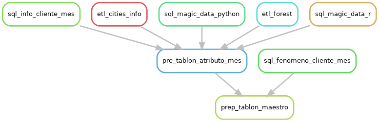

# Taller: Iniciación en Proyectos de Analítica Avanzada

Bienvenidos al repositorio del taller sobre la iniciación en proyectos de analítica avanzada.

**Objetivo del Taller:**

Nuestro propósito es guiar a los participantes en el arranque exitoso de un proyecto. En este taller, enfatizaremos la importancia de definir con claridad:

* Las metodologías óptimas.
* La infraestructura necesaria.
* Las herramientas recomendadas.

Al final, los participantes contarán con una comprensión sólida sobre cómo desarrollar proyectos de analítica avanzada de manera eficiente y efectiva.

## Aprendizaje a desarrollar

1. **Metodologia**: Documentar correctamente el proyecto.
    * README.md
    * Bitacora
2. **Infraestructura**: Almacenamiento en base de datos.
    * relacional:Sqlite
    * columnar: duckdb
    * object oriented storage: S3, Mimo
    * file system. 
3. **Infraestructura**: Entender el poder de computo del computador a ocupar
    * CPU
    * GPU
    * RAM
4. **Infraestructura**: Control de versiones de código.
    * Git
    * Github
5. **Metodologia**: Interfaz de interracion.
    * RStudio
    * Visual Studio Code
    * Terminal
6. **Herramientas**: Herramienta de apoyo de desarrollo de código.
    * Virtualenv, renv, conda   
7. **Herramientas**: Herramienta de apoyo de ejecucion de código.
    * Snakemake
    * Bash
8. **Herramientas**: Herramienta de apoyo de disponibilizar de código.
    * Docker
    * API   
9. **Metodologia**: Servicios de apoyo de desarrollo de código.
    * Github
    * ChatGPT
    * Stackoverflow
    * Copilot
    * Pizara
10. **Metodologia**: Tipo de estructura de ejecucion.
    * Flujo de Datos
    * Flujo de tareas
11. **Metodologia**: Tipo de paradigma de programación.
    * Funcional 
    * Orientado a objetos
    * Declarativo
    * Imperativo
12. **Metodologia**: Estructura de carpeta.
11. **Metodologia**: Estructura de codigo.

## Recursos Relevantes

* [Repaso de la Metodologia de Desarrollo](https://www.canva.com/design/DAFo5Xc27uQ/5LfD5LpkH7PHxI94PyOM6Q/edit?utm_content=DAFo5Xc27uQ&utm_campaign=designshare&utm_medium=link2&utm_source=sharebutton)
* [Bitacora del Proyecto](https://www.canva.com/design/DAFsTJKVQUY/ytdDubyKQPADVpdjpT6O8g/edit?utm_content=DAFsTJKVQUY&utm_campaign=designshare&utm_medium=link2&utm_source=sharebutton)
* [Presentacion](https://www.canva.com/design/DAFo5Xc27uQ/5LfD5LpkH7PHxI94PyOM6Q/edit?utm_content=DAFo5Xc27uQ&utm_campaign=designshare&utm_medium=link2&utm_source=sharebutton)
* [Papers](http://google.com)

## Conocimientos previos.
* Conocimientos basicos de R
* Conocimientos basicos de Python
* Conocimientos basicos de SQL
* Conocimientos basicos de AWS
* Conocimientos basicos de Git
* Conocimientos basico de Linux y Bash
* Conocimientos basicos en Nano o Vim

## Herramientas ya instaladas.

Herramientas necesarias para ejecutar el proyecto:

* WSL
* Terminal
* Visual Studio Code
* Web Browser

## Contenido

* [Configuración Inicial Basica](#configuración-inicial)


# Configuración Inicial Basica

En esta sección se detalla la configuración inicial de la infraestructura para poder ejecutar el proyecto. Sigue los pasos en orden y al detalle.

Cuando aparece un comoando entre <>, significa que hay que reemplazarlo por el valor correspondiente segun el caso.

## Iniciar WSL

* Abrir la terminal WSL

## Clonar el proyecto
```
cd ~/Documents/
git clone https://github.com/en-coders-cl/taller_iniciacion_proyecto.git
```

## Crear carpeta "file"

* Crear carpeta "file" en la raiz del proyecto
```
cd ~/Documents/taller_iniciacion_proyecto
mkdir files
```


* Nota: Estos archivos estan en el .gitignore, por lo que no se suben al repositorio.

## Ocupar renv para instalar librerias de R

Instalar librerias necesarias para ejecución de proyecto:

* Abrir el proyecto desde RStudio o ingresando a la carpeta del proyecto desde la consola  y iniciar la consolta de R:
* La primerae vez que se ingresa va a instalar la version renv correspondiente al proyecto


```r
renv::restore(exclude = c('enpiper','Matrix'), prompt = F)
```

* Instalar arrow
```r	
arrow::install_arrow() 
```

## Instalación de librerias internas: Pipe


```r
renv::install("devtools")
```

A continuación, instalar el enpiper utilizando la siguiente función en la misma consola de R:

```r
devtools::install_github("en-coders-cl/enpiper")
```

## Ocupar virtualenv para instalar librerias de Python

Instalar librerias necesarias para ejecución de proyecto:

#codigo para instalar virtualenv
```bash
sudo apt-get install python3-venv
```

* Abrir el proyecto desde Visual Studio Code o en una terminal:

```bash
cd ~/Documents/taller_iniciacion_proyecto
virtualenv venv
source venv/bin/activate
pip install -r requirements.txt
```
## Instalar paquete de python interno epipe

```bash
pip install git+https://github.com/en-coders-cl/enpipe.git
```


# Entender el proyecto

## Contexto

El psudo problema a resolver se trata de un problema de clasificación riesgo de fuga de clientes.


## Estructura de Carpetas

El proyecto esta compuesto por las siguientes carpetas:

* files: Contiene los datos del proyecto
* execution: Contiene los scripts de ejecución de la inferencia
* functions: Contiene las funciones utilizada en varios scripts
* insights: Contiene un EDA de los datos
* models: Contiene los modelos entrenados
* pipeline: Contiene los scripts de ejecución del pipeline
* reports: Contiene los reportes de los modelos
* tests: Contiene las unidades de test 
* prepocessing: Contiene los scripts de preprocesamiento de los datos
* etl: Contiene script para la extracción de los datos de fuentes externas, que no estan en el datalake

## Estructura de Archivos


* .Renviron: Contiene las credenciales de acceso al bitbucket
* .env: Contiene las credenciales de acceso al y bitbucket
* .gitignore: Contiene los archivos que no se deben subir al repositorio
* requirements.txt: Contiene las librerias de python necesarias para ejecutar el proyecto
* renv.lock: Contiene las librerias de R necesarias para ejecutar el proyecto
* config.yml: Contiene la configuración de snakemake
 

# Flujo de Ejecución

## DAG de Tablon Maestro



Poner el DAG de Modelamiento

Poner el DAG de Inferencia
 

# Ejecucion del pipeline via Script


* Ejecutar el script de tablon maestro. Genera el tablon maestro para entrenar el modelo y hacer analisis exploratorio de los datos.
```
Rscript pipeline/p1_tablon_master.R
```

* Ejecutar el script de modelamiento. Genera el modelo y los reportes de performance.
```
Rscript pipeline/model.R
```

* Ejecutar el script de inferencia. Crear el tablon de inferencia y genera el el resultado de inferencia.
```
Rscript pipeline/inference.R
```


# Ejecución del pipeline via Snakemake

Los DataLab vienen con conda y snakemake ya installados.

## Instalar Snakemake

```
conda activate snakemake
snakemake --help
```

## Instalacion de Conda

```
conda --version
```


* https://docs.conda.io/en/latest/miniconda.html#linux-installers

Revisa que version de python tienes instalada.

```
python --version
```

* python 3.11: https://repo.anaconda.com/miniconda/Miniconda3-py311_23.5.2-0-Linux-x86_64.sh
* python 3.10: https://repo.anaconda.com/miniconda/Miniconda3-py310_23.5.2-0-Linux-x86_64.sh
* python 3.9: https://repo.anaconda.com/miniconda/Miniconda3-py39_23.5.2-0-Linux-x86_64.sh
* python 3.8: https://repo.anaconda.com/miniconda/Miniconda3-py38_23.5.2-0-Linux-x86_64.sh


```
wget https://repo.anaconda.com/miniconda/Miniconda3-py39_23.5.2-0-Linux-x86_64.sh
bash Miniconda3-py39_23.5.2-0-Linux-x86_64.sh
```

* Installar snakemake
```
conda install -n base -c conda-forge mamba
conda activate base
mamba create -c conda-forge -c bioconda -n snakemake snakemake
conda activate snakemake
snakemake --help
```


* Crear archivo .env para guardar el valor de una variable que ayuda a generar archivos unicos por ejecucion.
```
nano .env
```

```
version=<prueba>
```


* Activar snakeMake
```
conda activate snakemake
```

* Ejectuar el pipeline tablon maestro. Genera el tablon maestro para entrenar el modelo y hacer analisis exploratorio de los datos.
```
snakemake -c1 -s pipeline/pipe1_tablon_master.smk prep_tablon_maestro
```

* Ejecutar el pipeline de modelamiento. Genera el modelo y los reportes de performance.
```
snakemake --cores 1  -s pipeline/model.smk
```

* Ejecutar el pipeline tablon de inferencia. Crear el tablon de inferencia y genera el el resultado de inferencia.
```
snakemake --cores 1 --use-conda -s pipeline/inference.snakefile
```

* Generar los DAG
```
snakemake -c1 -s pipeline/pipe_tablon_master.smk prep_tablon_maestro --forceall --rulegraph | dot -Tpng > dag_tablon_master.png
```


